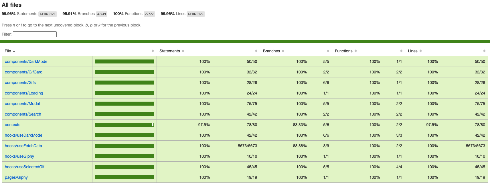

# AutoAddress Test

## Overview
Test carried out for the AutoAddress company. Thank you in advance for the opportunity and I hope it's up to what you're looking for.

In this project you can check out the main gifs of the moment, using the Giphy API as an integration. You can also search for your favourite gif using the search bar. You can use the site in light and dark mode


## Installation

```bash
npm install

npm run dev
```

Node version 18.16.0 was used. If there are any incompatibility problems, I recommend installing the same version. You can do this using nvm and run `nvm use` in the root of the project.

## Test coverage
This project has complete test coverage. You can check this by running

```bash
npm run test:coverage
```
You can open the `index.html` file created inside the `coverage` folder to check in more detail.



## Documentation
This project also contains documentation material on the main functions and types, using `TypeDocs`. You can check this by running

```bash
npm run doc
```

Once the documentation has been generated, you can open the `index.html` file located in the `docs` folder.

## Technology

This project was created, tested and documented with:
- React + Vite
- TailwindCss
- Framer Motion
- Jest
- Vitest
- React Testing Library
- Type Doc